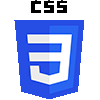

  ### Hi there 

<h2> I am, Nwachan Theophile</h2>

<h3>Full-stack Software Engineer</h3>
<h3>I am currently available for hire</h3>

Get to me on 

My <a href="https://nwachan-theophile.netlify.app/">Portfolio</a>
 

  

  

                  

I am a highly-skilled, motivated, and talented Full-stack web developer with a passion for developing outstanding software for great user experience and high customer satisfaction. I take much care in the things I develop because a customer is key.

I like contributing to open source codes as there is a great asset for others to learn.

## Links To Some Of My Projects

| [Visit School Website](https://hitlbamenda.cm/) |   [Visit Fashion Designer](https://tcdesign.fashion/) |
| ---------- | ----------- |
 |  |  |

<!--

[Click to see the Website](https://jaems.art/)
[Click to see the Website](https://christinductionglorychurch.com/)
-->

&nbsp;
 
| Activities |   Languages |
| ---------- | ----------- |
 |  | |

## Technologies & Tools

        
        
    
    
    
    
        
     
    
    
      
    
    
    
    
    

## Connect with me

<!--
**Theophileaseh/Theophileaseh** is a ✨ _special_ ✨ repository because its `README.md` (this file) appears on your GitHub profile.

Here are some ideas to get you started:

- 🔭 I’m currently working on ...
- 🌱 I’m currently learning ...
- 👯 I’m looking to collaborate on ...
- 🤔 I’m looking for help with ...
- 💬 Ask me about ...
- 📫 How to reach me: ...
- 😄 Pronouns: ...
- ⚡ Fun fact: ...
-->
